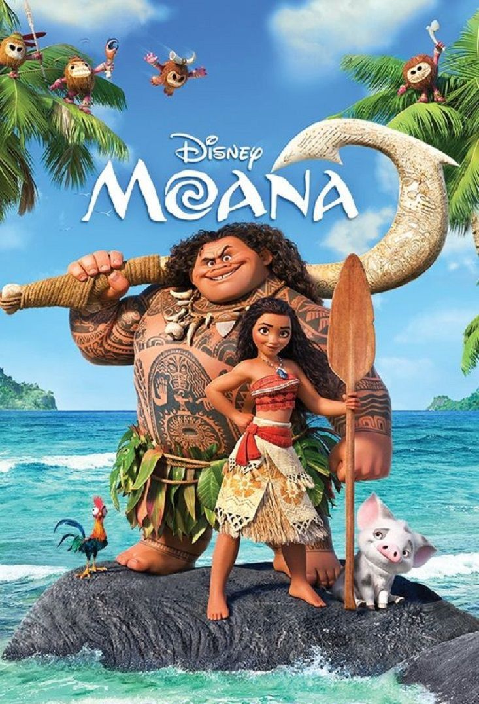
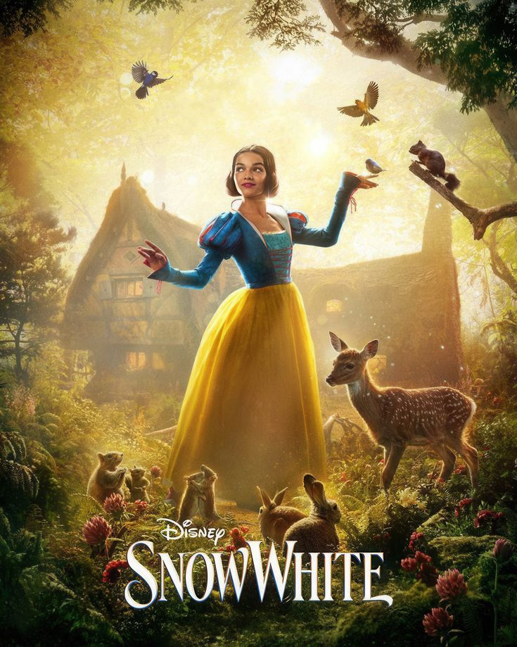
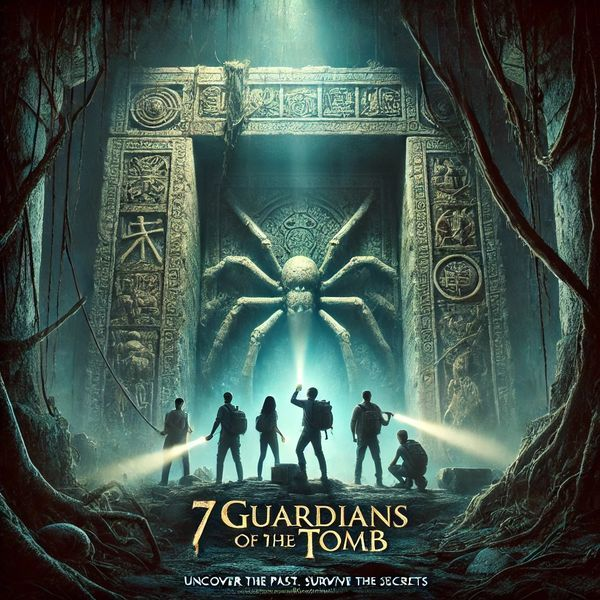
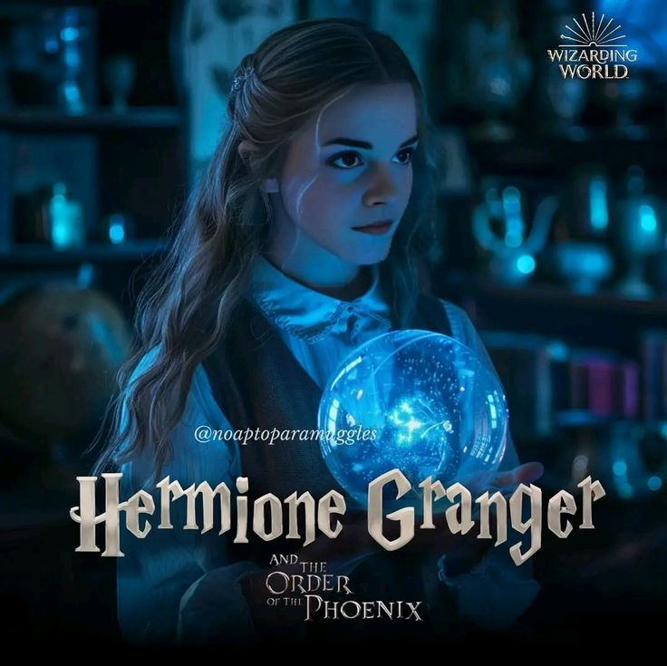
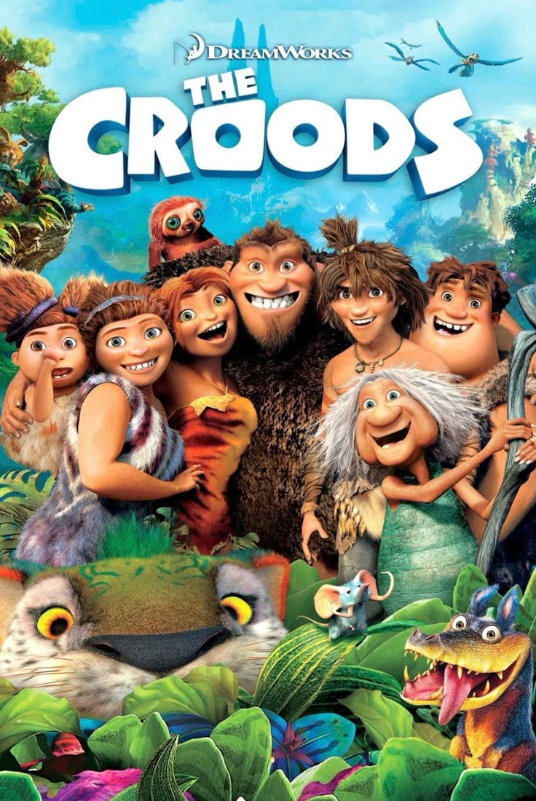

# NetFlix_Clone
## Date: 10/7/25
## Objective:
To create a modern, responsive navigation bar using CSS Flexbox, mimicking real-world websites like Netflix. This helps reinforce alignment, spacing, and layout structuring using Flexbox properties.

## Tasks:

#### 1. Structure the HTML Layout:
Use a ```<nav>``` tag as the main container.

Add a brand logo/title on the left using a ```<div> or <h1>```.

Add navigation links like Home, Menu, About, Contact, and Login using a ```<ul> with <li> and <a>```.

#### 2. Apply Flexbox for Layout:
Use display: flex on the ```<nav>``` container.

Use justify-content: space-between to align the logo and menu.

Use align-items: center to vertically center both sections.

Style list items with horizontal spacing using gap or margin.

#### 3. Style Like a Real-World Navbar:
Add background color (e.g., dark or gradient like Netflix/Zomato).

Style text with bold fonts, hover effects, and link styling.

Remove default ul and li styles (list-style: none, text-decoration: none).

#### 4. Bonus Enhancements:
Add a hover underline or button effect on links.

Make it responsive using flex-wrap or media queries.

Fix the nav bar to top with position: sticky.
## HTML Code:
```
<!DOCTYPE html>
<html lang="en">
<head>
  <meta charset="UTF-8" />
  <meta name="viewport" content="width=device-width, initial-scale=1.0"/>
  <title>Netflix Clone</title>
  <link rel="stylesheet" href="style.css"/>
</head>
<body>

  <nav class="navbar">
    <div class="logo">NETFLIX</div>
    <ul class="navlinks">
      <li><a href="#">TV Shows</a></li>
      <li><a href="#">Movies</a></li>
      <li><a href="#">Recently Added</a></li>
      <li><a href="#">My List</a></li>
    </ul>
    <div class="search">&#128269;</div>
  </nav>

  <header class="hero">
    <div class="overlay"></div>
    <div class="herotext">
      <h4>N SERIES</h4>
      <h1>FROZEN<br>NORTHEN LIGHTS</h1>
      <p>As Anna battles the elements and encounters magical creatures,<br> she learns the true meaning of love and sisterhood.</p>
      <div class="herobuttons">
        <button class="btnplay">▶ Play</button>
        <button class="btnlist"> My List</button>
      </div>
    </div>
  </header>

  <section class="popular">
    <h2>Popular on Netflix</h2>
    <div class="movierow">
      <div class="moviecard"><p>Hermonie Grange</p></div>
      <div class="moviecard"><p>Snow White</p></div>
      <div class="moviecard"><p>7 Guardians Of The Tomb</p></div>
      <div class="moviecard"><p>Hermonie Grange</p></div>
      <div class="moviecard"><p>Avatar 3</p></div>
      <div class="moviecard"><p>The Coords</p></div>
      <div class="moviecard"><p>Tangled</p></div>
      <div class="moviecard"><p>Tinker Bell</p></div>
    </div>
  </section>

</body>
</html>

```
## CSS Code:
```
* {
  margin: 0;
  padding: 0;
  box-sizing: border-box;
}

body {
  background: #111;
  color: white;
  font-family: Arial, sans-serif;
}

.navbar {
  display: flex;
  justify-content: space-between;
  align-items: center;
  background-color: black;
  padding: 15px 30px;
  top: 0;
  z-index: 10;
}

.logo {
  color: red;
  font-size: 26px;
  font-weight: bold;
}

.navlinks {
  display: flex;
  gap: 20px;
  list-style: none;
}

.navlinks a {
  text-decoration: none;
  color: white;
  font-weight: 500;
}

.search {
  font-size: 18px;
  cursor: pointer;
}

.hero {
  position: relative;
  height: 80vh;
  background: url('frontimg.jpg') no-repeat center center/cover;
  display: flex;
  align-items: flex-end;
  padding: 50px;
}

.overlay {
  position: absolute;
  top: 0; left: 0;
  width: 100%; height: 100%;
  background: linear-gradient(to top, #111 10%, transparent 90%);
}

.herotext {
  position: relative;
  max-width: 600px;
  z-index: 1;
}

.herotext h4 {
  color: red;
  font-weight: bold;
  margin-bottom: 10px;
}

.herotext h1 {
  font-size: 48px;
  line-height: 1.1;
  margin-bottom: 20px;
}

.herotext p {
  font-size: 15px;
  color: #ccc;
  margin-bottom: 20px;
}

.herobuttons {
  display: flex;
  gap: 15px;
}

.btnplay,
.btnlist {
  padding: 10px 20px;
  font-size: 14px;
  font-weight: bold;
  cursor: pointer;
  border: none;
  border-radius: 3px;
}

.btnplay {
  background-color: white;
  color: black;
}

.btnlist {
  background-color: rgba(109, 109, 110, 0.7);
  color: white;
}

.popular {
  padding: 30px;
}

.popular h2 {
  margin-bottom: 20px;
  font-size: 20px;
}

.movierow {
  display: flex;
  overflow-x: auto;
  gap: 15px;
  padding-bottom: 10px;
}

.movierow::-webkit-scrollbar {
  height: 8px;
}

.movierow::-webkit-scrollbar-thumb {
  background-color: #444;
  border-radius: 4px;
}

.moviecard {
  flex: 0 0 auto;
  width: 160px;
}

.moviecard img {
  width: 100%;
  border-radius: 4px;
  height: 240px;
  object-fit: cover;
}

.moviecard p {
  margin-top: 6px;
  font-size: 13px;
  text-align: center;
  color: #ddd;
}

```
## Output:


## Result:
A modern, responsive navigation bar using CSS Flexbox, mimicking real-world websites like Netflix. This helps reinforce alignment, spacing, and layout structuring using Flexbox properties is created successfully.
